# Traveluxe
Traveluxe is a django-based coherent and practical hub for renting out and booking properties and vacation homes. The user will be greeted with a simple yet formatted website with the purpose of effectively delivering information to the user through the use of techniques and features found frequently in social media platforms. This is done to catch the user's eye through the use of visual queues and so that the information is delivered concisely, in manageable and understandable amounts.

[Live website link](https://traveluxe2-d0488e7a8b6f.herokuapp.com/)
---

## Directory of contents

### User Experience
* Project Goals
* Agile Methodology
* Target Audience
* First time user
* Registered user
* Admin user
### Design
* Color Scheme
* Cabin Images
* Wireframes
* Data Model
* User Journey
* Database Scheme
### Security Features
### Features
* Existing Features
* Features Left to Implement
* Technologies Used
* Languages Used
* Databases Used
* Frameworks Used
* Programs Used
### Deployment and Local developement
* Local Developement
* ElephantSQL Database
* Cloudinary
* Heroku Deployment
### Testing
### References
* Docs
* Content
* Acknowledgments
---

## User Experience(UX)

Encounter and explore a mesmerising and thought provoking user experience with Traveluxe! This website offers effective information delivery in the form of aesthetically pleasing visuals and a hassle-free social media-like system for renting out and booking properties and rental homes. Cohesive and tailored posts will deliver compact yet informative value to the user, matched with a responsive support system to meet the needs of the user insuring that the user's goals are met without issue when visiting and traversing the website. Wether you want to write a review on a home you've visited in the past with us, or you're looking to invite other's to stay at your home whilst you're away, cold weather, or warm, Traveluxe is made to produce an easy and comfortable booking process for new and returning users!

## Project Goals

The goal of Traveluxe is to create a casual and explorative hub, for visitors to make new relationships whilst booking/posting their homes, and immersing themselves in the Traveluxe website. The project aim is to result in a positive user experience showcasing the utility of the website and its features, whilst allowing the user to explore the different types of homes currently listed, or to add their own!

## Agile Methodology

Agile methodolgy was used frequently, to help create a clean, organised and well-ordered experience for myself as a devloper when creating the building blocks for this website. Agile methodology was used in the creation of the user-stories as well as the project boards on GitHub. A template was also made to define epics and effectively write up my user stories:

* Firstly, the Epics were written containing potential user stories, based on order priority and in order of when they would be required.
* User stories were made by looking at these epics, and again based on the project's timeline and progress.
* The project Board was used to track progression of the task through the Todo, In progress and Done columns.
* The project Board ias set to public at the end.

Agile Methodology Images

 

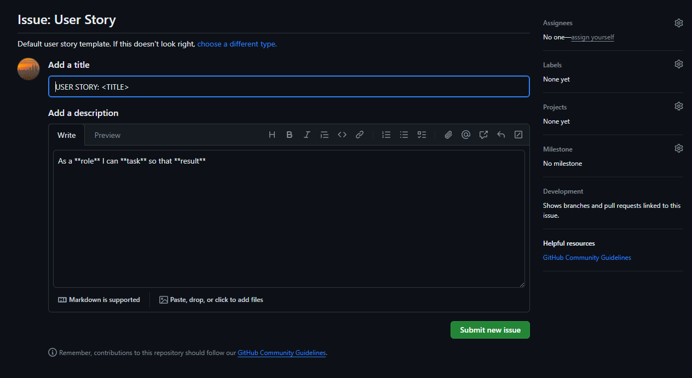
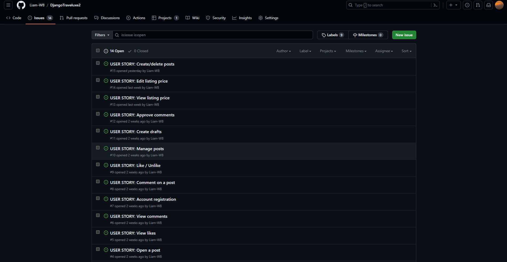
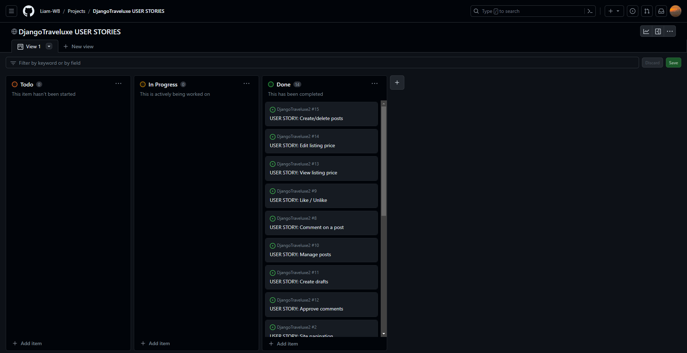

## User Stories

### Epics

* Initial Deployment
* Home Page
* User Registration
* Website Admin, Posts
* Post Likes, Comments
* Maintain consistent design with responsiveness in mind

### Issues/User Stories

* Site Pagination
* View Post List
* Open a Post
* View Likes
* View Comments
* Account Registration
* Comment on a Post
* Like/Unlike
* Manage Posts
* Create Drafts
* Approve Comments
* View Listing Price
* Edit Listing Price
* Create/Delete Posts

[GitHub Project link](https://github.com/Liam-WB/DjangoTraveluxe2)
[Project Board link](https://github.com/users/Liam-WB/projects/7/views/1)

### Target Audience

* People looking for a getaway spot, whilst having the chance to casually get in touch with the propety owner.
* People looking for recommendations on good travel spots/afforable alternatives to a hotel.
* People looking for a good travel location for family/friends.
* People who value a captivating and positive visual online experience.
* Travel enthusiasts, interested in seeing how others live.
* Explorerers of any category, looking for something new.
* Couples looking for a romantic getaway, or time away from their home.
* Friends of family or friends or friends looking to get their friend a nice vacation.

### First Time User

* Intuitive and coherent website navigation for easy exploration and involvement.
* Immersive visuals showcasing the beauty of people's home's/properties as well as an aesthetic UI to match.
* Informative content providing an overview of posts, details or their subject properties and comment/like features to be involved in the conversation.
* User-friendly forms with clear validation messages to ensure accurate input.
* Simple Registration process.

### Registered User

* A seamless login process with a secure and personalised user social account.
* Browsing available retreats/homes.
* Access to a tailored dashboard showing all formatted posts and their detaile, in order of the date and time of update.
* Ability to modify/create posts made.
  
### Admin user
  
* Secure and separate login portal for admin users with appropriate access control.
* Access to an admin dashboard for managing posts, comments, likes, users and social accounts.
* CRUD functionality in the form of the ability to add, add to, remove, remove from and morify the above listed categories.
* Management/filtering of content and approval of comments to control conversation subjects and approprieteness.
* Ability to delete user accounts, providing the necessary control for managing user data and accounts.
* Management of post creation, including the ability to view and modify.

## Design

The Traveluxe Website boasts an aesthetic, visually pleasing design, greeting new and returning users with two tone UI (navy blue to white contrast) for easy readability and a simple yet effective and consistent logo incorporating a Luxury and classy font with influences of European early modern printing. The navigation bar however, uses a modern, more rounded and more visible font when smaller fitted with text highlighting to allow for easy navigation. The footer follows the same design and is fitted with icons that also highlight when the cursor is hovering on them, for easier visibility, and all text in the footer is centered for practicality.

### Colour Scheme

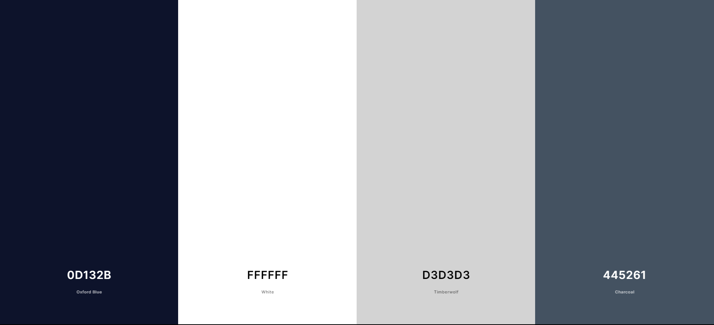

* I used a dark shade of red (#E84610) for the links.
* I used light and dark green for the post property rent price tags: rgba(10, 136, 10, 0.6), rgb(24, 202, 0).

### Property Images

Property images were sourced from different sites including free copyright generic picture generators and AI generators.

### Logo

Logo was created with generic logo creator [BrandCrowd](https://www.brandcrowd.com).

### Typography

The "Voga" font and regular bootstrap sans serif font were used for this project.

### Wireframes

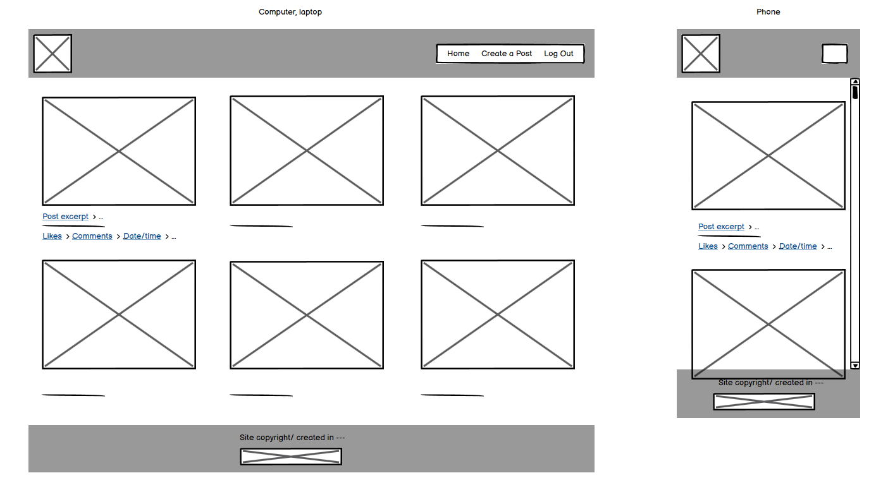
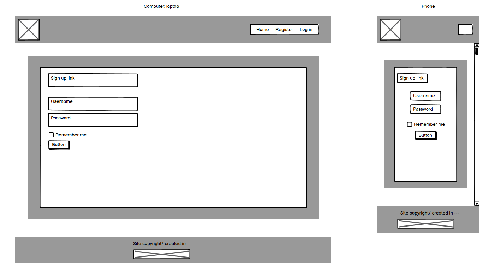
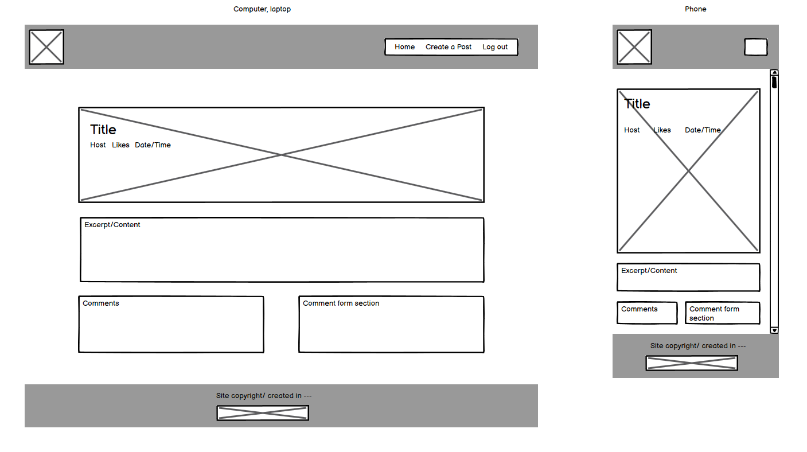
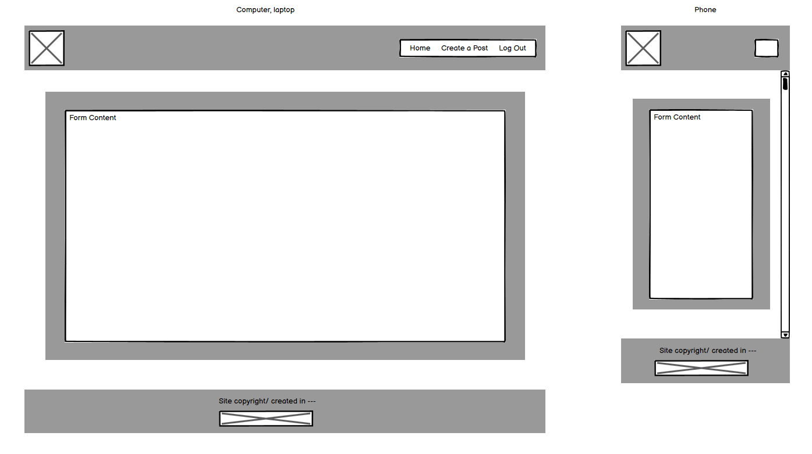
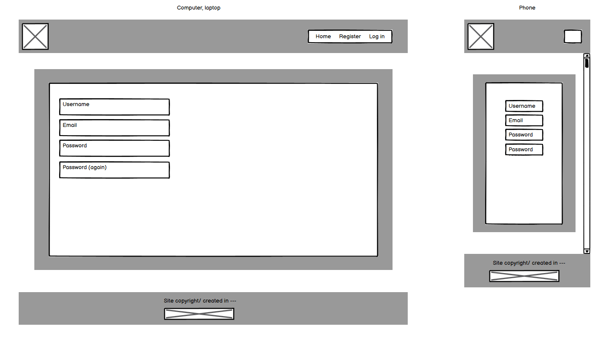

### Data Models

1. Post Model

This model was created for giving the posts datasets and values that can be manipulated with CRUD functionality. Some of these fields can only be manipulated in the admin page. The posts themselves are formatted in a 'Post List' to allow the user to view them in a paginated format. They were given the following fields:
* 'title'
* 'content'
* 'featured_image'
* 'excerpt'
* 'listing_currency'
* 'listing_timespan'
* 'listing_price'
* 'status'
* 'slug'
* 'author'
---

1. Post Comment Model

The Comment Model was created to add more functionality to the comments written by returning users and site users, as well as to filter their visibility and what can be done with them by users/admins.
---

3. CreateView Author Model

This model was made solely for the CreateView form as the author ID would clash with the author field User ID leading to an error without this model and the form would not validate.
---

### User journey

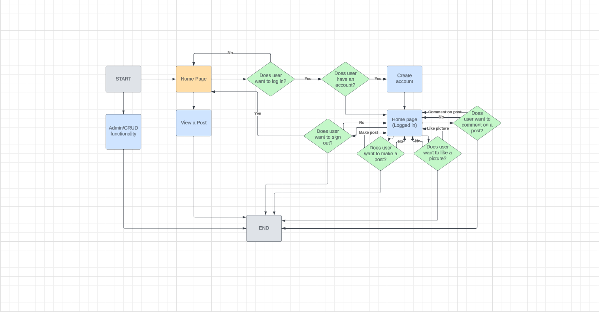

### Traveluxe entitu relationship diagram

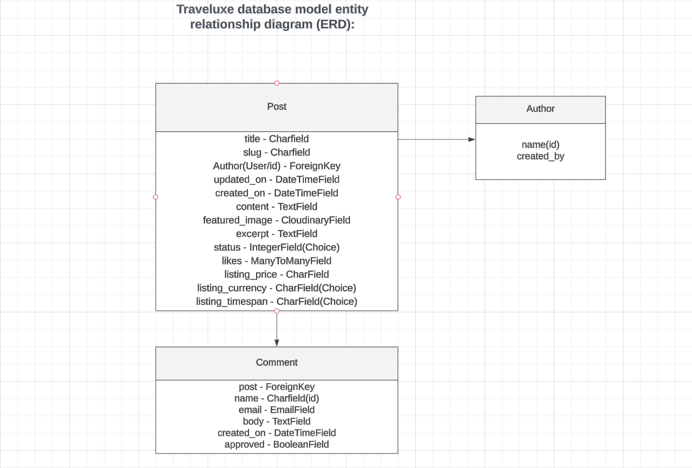

* As shown above the post model contains most of the fields as it is the largest and most frequently used data model.
* Most of the CharFields and TextFields are for the site user/admin to modify, to give the post individuality and will give a value to the related name.
* featured_image uses the cloudinary_field as cloudinary is holding and storing images like our logo and placeholder image, if the user decides to leave their post image section blank.
* The likes field is updated depending on the user id.
* The comment model is made to hold its fields, that will then be used to create a form that is rendered in views.py.
* The author model is made for the CreateView view that is used in views.py and holds the necessary information to validate its accompanied form.

This data scheme allows for the management of users, posts, their comments and their likes. Users can make specific posts, comment and like their and others' posts and admins can use CRUD functionality to modify this content.

## Security Features

### User Authentication

Django Allauth is used for authorization and authentication and provides a set of features for managing user authentication, registration, and account management.

### Login Decorator

account_login, account_signup, account_logout, post_detail, index.html: These views either involve operations related to user authentication and require authentication with the  decorator.
This ensures that only authenticated users can access these views.

### CSRF Protection

CSRF tokens are generated for each user session, and are required when submitting forms during a POST request. When a user logs out, the session and associated CSRF token are invalidated, making it difficult for an attacker to forge a valid request using a copied URL.

### Form Validation

The post_form view validates form input using the form_valid class located in the author model. It checks for various validation errors e.g. data errors, instance errors, object-not-found errors.

### Error pages

Error pages are returned if a request is not successfully recieved.

## Features
* The home page contains a tailored navbar made with bootstrap html, to adjust to all devices and switch to a pop-out navbar when device screen size reqches a certain size.
* The website features a comprehensive list of posts accompanied by detailed descriptions for each one.
* User can make an account and login.
* When logged in, users get access to extra features such as comments, likes and creating their own posts.
* Admins can filter and modify content/posts.
* Most user actions are accompanied by a corresponding message to ensure that users are promptly notified of any changes or updates.
* Location and rent and price are shown on the homepage's post list to ensure that the user recieves the highest priority information first.