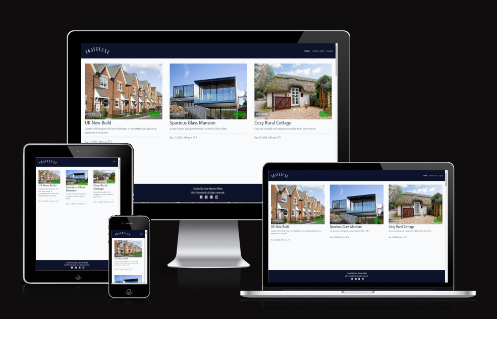

# Traveluxe
Traveluxe is a django-based coherent and practical hub for renting out and booking properties and vacation homes. The user will be greeted with a simple yet formatted website with the purpose of effectively delivering information to the user through the use of techniques and features found frequently in social media platforms. This is done to catch the user's eye through the use of visual queues and so that the information is delivered concisely, in manageable and understandable amounts.

[Live website link](https://traveluxe2-d0488e7a8b6f.herokuapp.com/)
---

## Directory of contents

### User Experience
* Project Goals
* Agile Methodology
* Target Audience
* First time user
* Registered user
* Admin user
### Design
* Color Scheme
* Cabin Images
* Wireframes
* Data Model
* User Journey
* Database Scheme
### Security Features
### Features
* Existing Features
* Features Left to Implement
* Technologies Used
* Languages Used
* Databases Used
* Frameworks Used
* Programs Used
### Deployment and Local developement
* Local Developement
* ElephantSQL Database
* Cloudinary
* Heroku Deployment
### Testing
### References
* Docs
* Content
* Acknowledgments
---

## User Experience(UX)

Explore 