# Traveluxe | Tests

Return to [README.md]

---

Comprehensive testing has been done to ensure that the website's functions and features work flawlessly, and without issue.

## Directory of Contents

### Responsiveness Tests

### Browser Compatibility Tests

### Device Tests

### Code Validation
## * HTML Validation
## * CSS Validation
## * JavaScript Validation
## * Python

### Lighthouse Report

### Bugs
## * Resolved Bugs
## * Unresolved Bugs

### Features Tests

---

## Responsiveness Tests

This deployed Traveluxe website has underwent rigorous and frequent testing on multiple devices and screen sizes to ensure its responsiveness and adaptability. Developer Tools were utilized to simulate various screen sizes, enabling thorough examination of how the website behaves across different devices. Bootstrap classes and media queries have been implemented to achieve the desired design, ensuring that the website maintains its visual and functional integrity on all platforms, to create a positive user experience.

### Different Screen Sizes

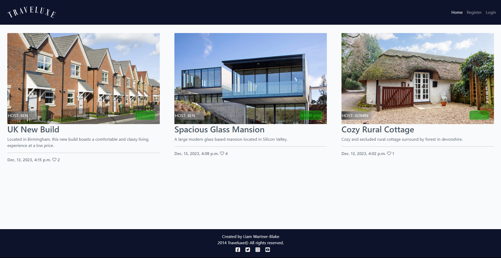
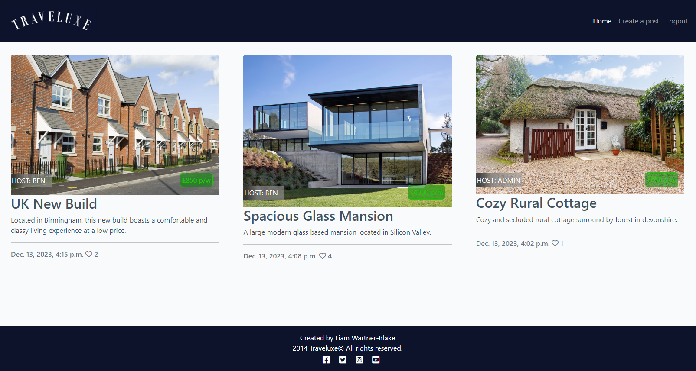
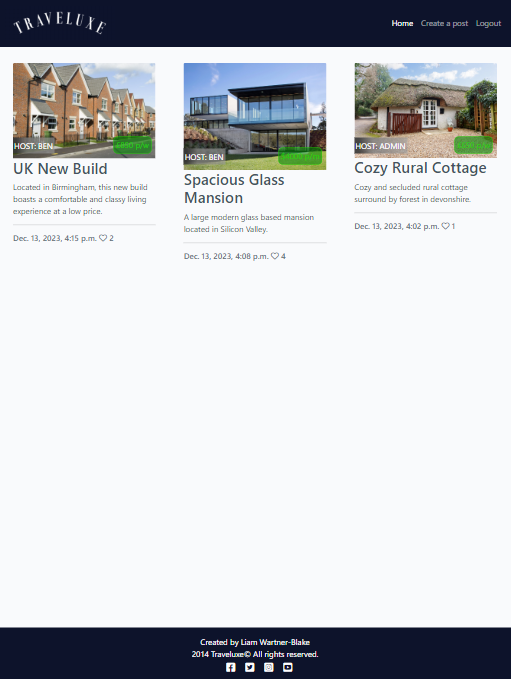

## Browser Compatibility Tests

The website was also tested on google chrome, microsoft edge, firefox and iOS safari. The website worked as intended.

## Code Validation

### HTML Validation

The website was tested on [W3C HTML Validator](https://validator.w3.org/nu), and the below listed HTML was checked for errors:

* base.html
* index.html
* post_detail.html
* post_form.html
* account_login,logout,signup.html

The results showed no major errors.

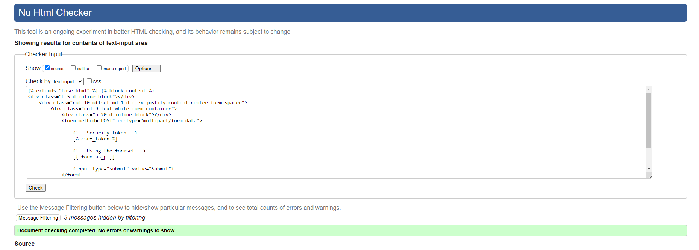

### CSS Validation

The website was tested on [W3C CSS Validator](https://jigsaw.w3.org/css-validator/), and the style.css file showed no errors.

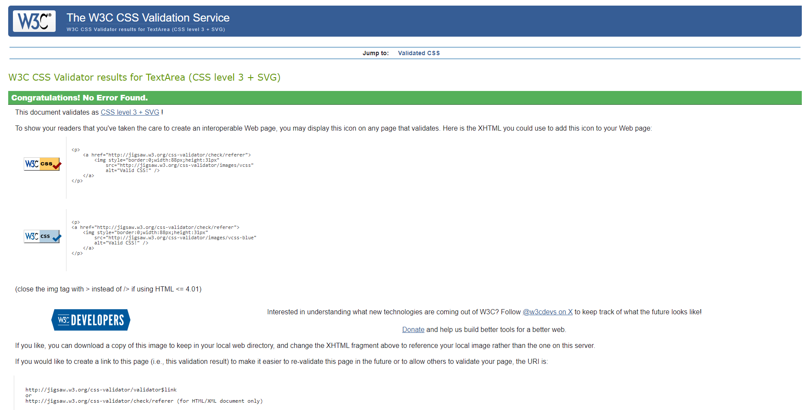

### JavaScript Validation

No issues or errors were made present during JavaScript testing and validation.

### Python Validation

The following Python files were validated and checked with [Python Linter](https://pep8ci.herokuapp.com/):

#### market

* admin.py
* app.py
* forms.py
* models.py
* teste.py
* urls.py
* views.py

#### traveluxe

* settings.py
* urls.py

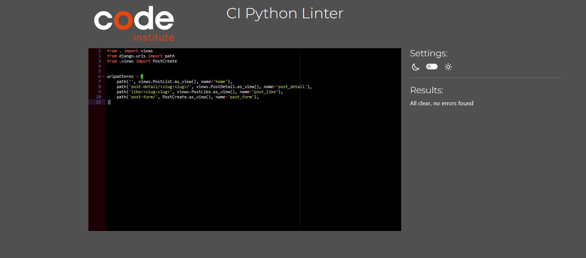
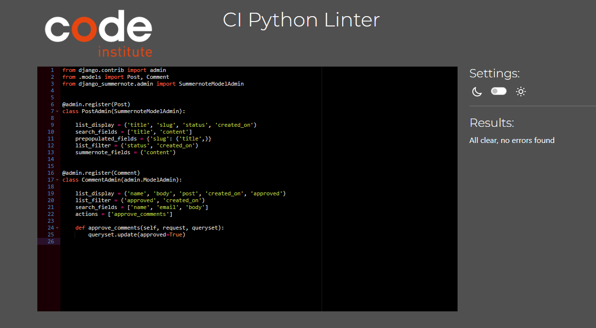
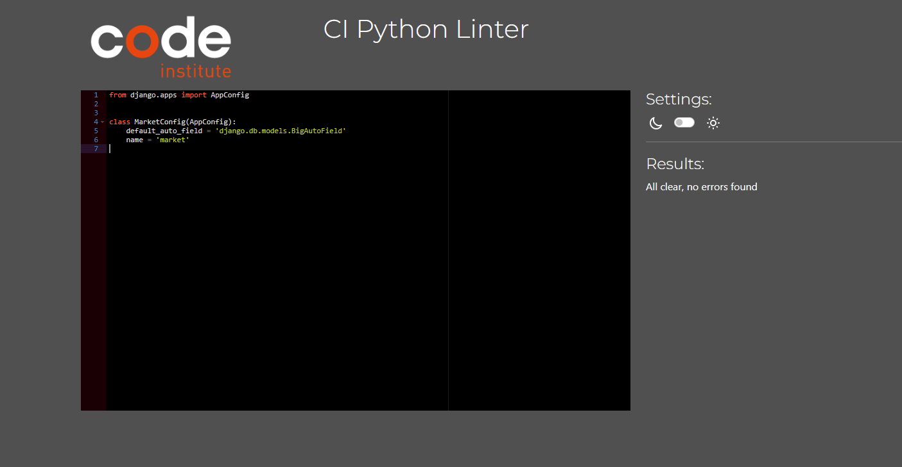
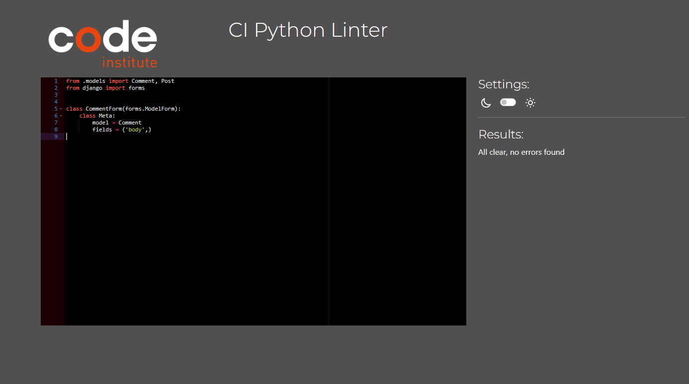
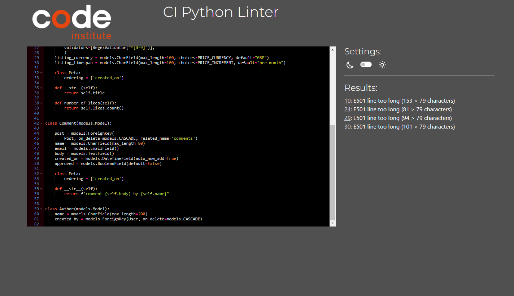
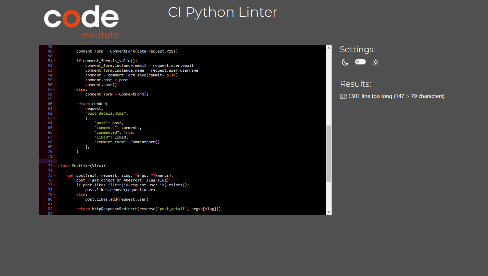
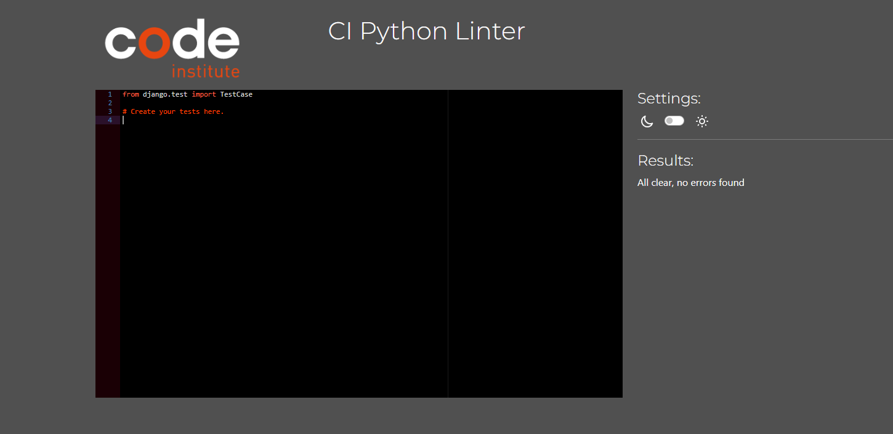
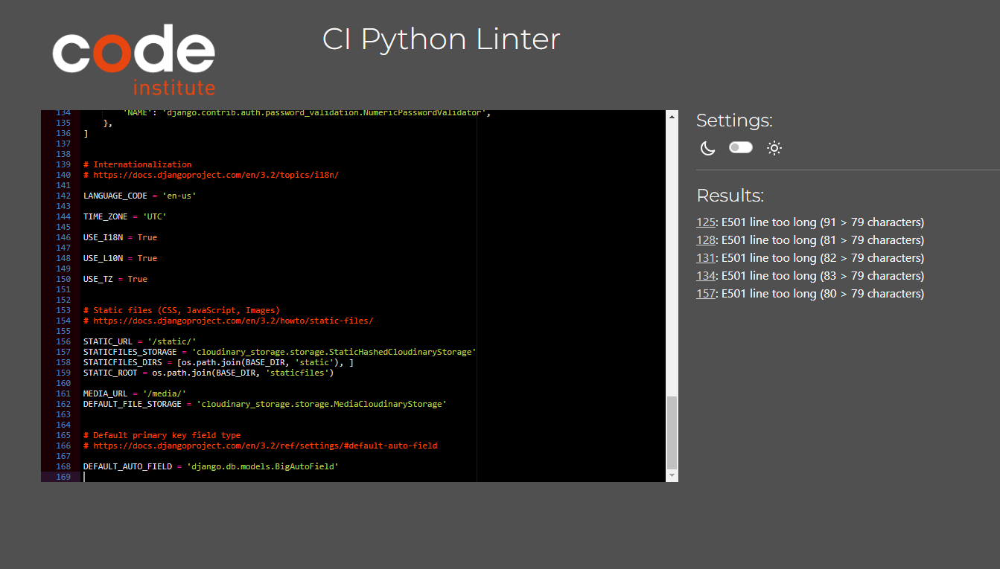
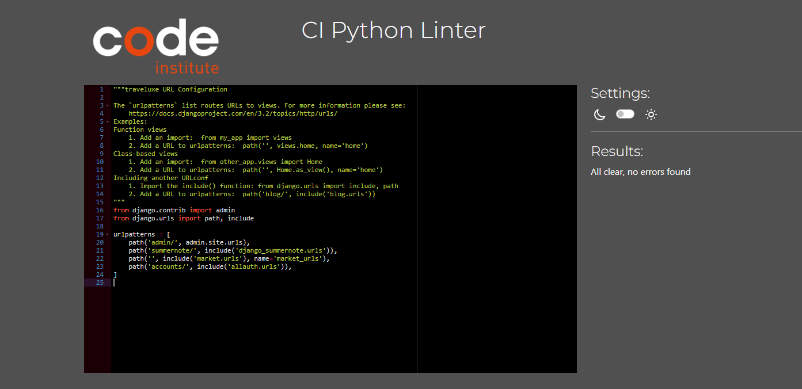

## Lighthouse Reports

The following pages were checked for lighthouse reports:

* index.html
* post_detail.html
* post_form.html
* account_login,logout,signup.html

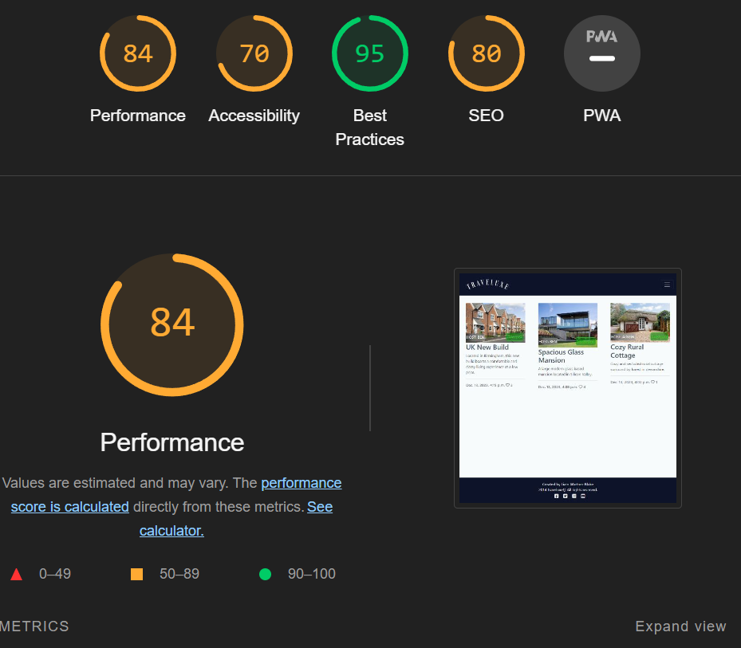
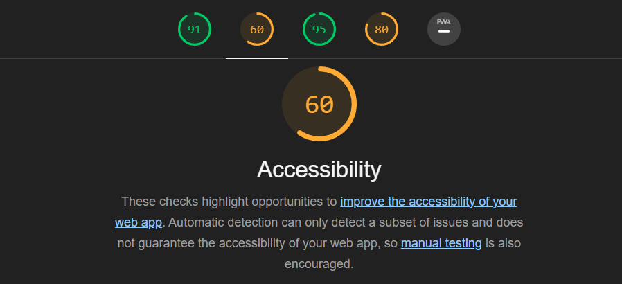
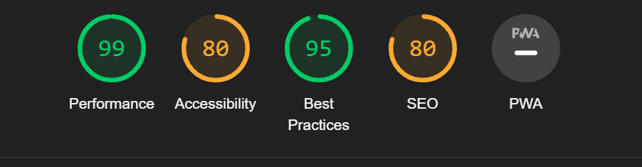
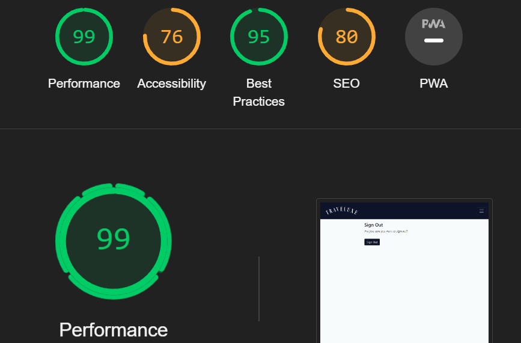
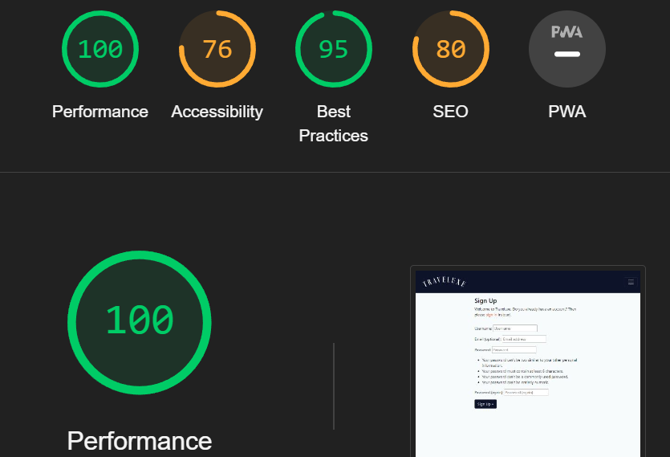
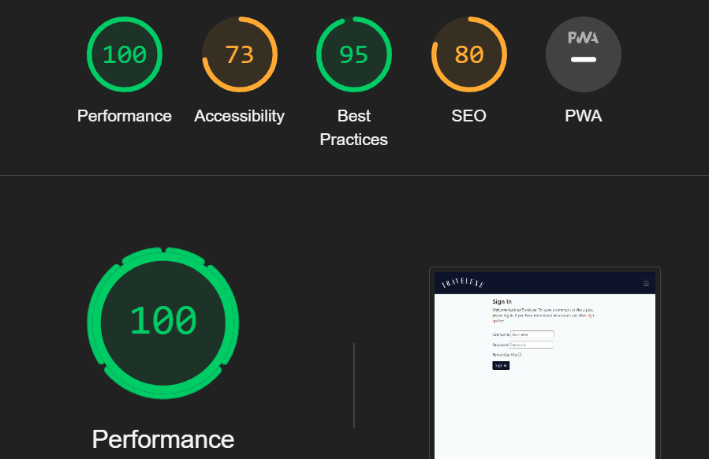